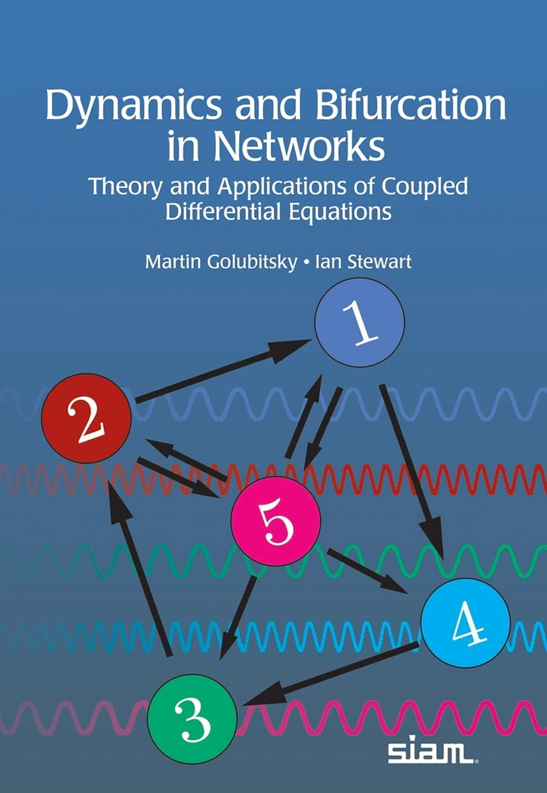
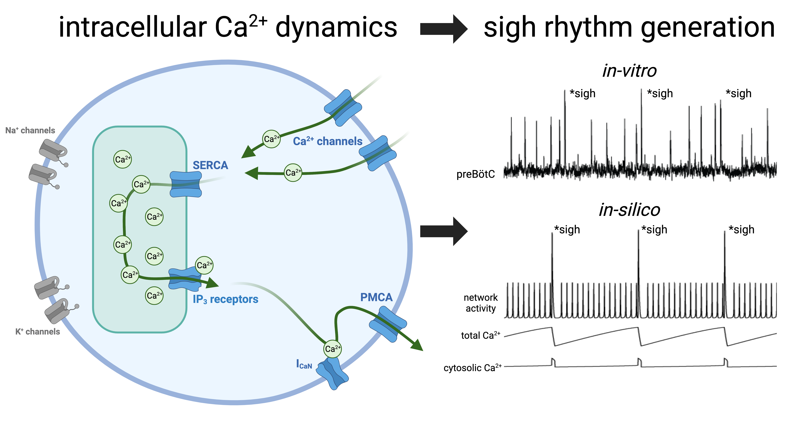

# Assignments

Imported from `REU - Onboarding and How To's.enex`.

## Other Short-term Assignments and Project Ideas

_Created: 2023-11-03; Updated: 2024-02-01_

AI agents

AI working on local files

Octopus articles from Current Biology

Looking for theoretical questions related to neural evolution

Github pages and Jekyll

REU Idea - small structural differences in the transcription factors from alleles A and B leading to less effective binding to the regulatory site associated with the alternate allele type. This choice is consistent with small structural differences in the transcription factors from alleles A and B leading to less effective binding to the regulatory side associated with the alternate allele type.

## Short-term Assignment - Bifurcations in Networks

_Created: 2023-11-03; Updated: 2024-01-30_

Read the introductory chapter of **Dynamics and Bifurcation in Networks: Theory and Applications of Coupled Differential Equations**by Martin Golubitsky and Ian Stewart.

[https://epubs.siam.org/doi/book/10.1137/1.9781611977332](https://epubs.siam.org/doi/book/10.1137/1.9781611977332)

Share the introductory chapter in a group meeting.

Then look through the various chapters of the book to see if there are topics that the group should pursue in more detail.

## Short-term Assignment - Diversity and entropy

_Created: 2023-11-03; Updated: 2023-11-09_

Read the initial chapter(s) of **Diversity and Entropy: An axiomatic approach** by Tom Leinster. [https://www.maths.ed.ac.uk/~tl/ed/](https://www.maths.ed.ac.uk/~tl/ed/)

Can we see possibilities for genomic data science applications of the mathematical ideas and statistical methods in this book

The idea is that we would apply our understanding of these topics to the study of cellular diversity and/or determination of cell types.

I have a copy of the book, but we could start with this paper on the arXiv server: [https://arxiv.org/abs/2012.02113](https://arxiv.org/abs/2012.02113)

## Short-term Assignment - Explore BioRender - Software for scientific illustration

_Created: 2023-11-09; Updated: 2023-11-09_

[https://www.biorender.com](https://www.biorender.com)/

I would like to download the free version of this software and determine if it would be useful to the research group. Here is an example of a figure that Dan Borrus made using BioRender.

## Short term assignment - Explore EBRAINS research infrastructure

_Created: 2024-01-04; Updated: 2024-02-05_

The EBRAINS research infrastructure offers collaboratories with NEST and many other neuroscience tools pre-installed. I am seeking a research undergraduate to explore this software, get a demo working, and share with the group.

[https://www.ebrains.eu/data/collaboratory](https://www.ebrains.eu/data/collaboratory)

[https://www.ebrains.eu/tools/nest](https://www.ebrains.eu/tools/nest)

## Short-term assignment -  NEST and NESTML

_Created: 2024-01-26; Updated: 2024-02-01_

NEST is neural simulation software that could benefit several of our ongoing projects. I am seeking an undergraduate student who would download and run some of the demos of this software. Then share your experience with the group.

NEST

[https://nest-simulator.org](https://nest-simulator.org)

NEST documentation

[https://nest-simulator.readthedocs.io/en/stable/](https://nest-simulator.readthedocs.io/en/stable/)
