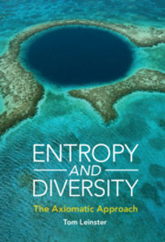

# Short-term Assignment - Diversity and entropy

Source Evernote title: `! Short-term Assignment - Diversity and entropy`  
Created: 2023-11-03  
Updated: 2023-11-09

## Attachments

- [cover.jpg](attachments/cover.jpg) (image/jpeg, 0.0 MB)

## Note

Read the initial chapter(s) of **Diversity and Entropy: An axiomatic approach** by Tom Leinster. [https://www.maths.ed.ac.uk/~tl/ed/](https://www.maths.ed.ac.uk/~tl/ed/)

Can we see possibilities for genomic data science applications of the mathematical ideas and statistical methods in this book

The idea is that we would apply our understanding of these topics to the study of cellular diversity and/or determination of cell types.

I have a copy of the book, but we could start with this paper on the arXiv server: [https://arxiv.org/abs/2012.02113](https://arxiv.org/abs/2012.02113)

