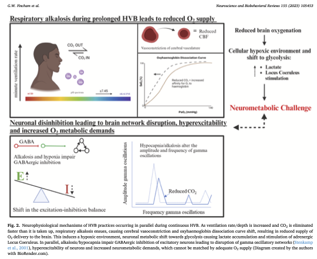
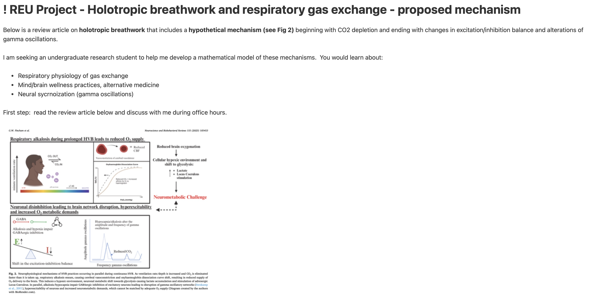

# REU Project - Holotropic breathwork and respiratory gas exchange - proposed mechanism

Source Evernote title: `! REU Project - Holotropic breathwork and respiratory gas exchange - proposed mechanism`  
Created: 2024-02-01  
Updated: 2024-02-01

## Attachments

- [1-s2.0-S0149763423004220-main.pdf](attachments/1-s2.0-S0149763423004220-main.pdf) (application/pdf, 2.4 MB)
- [BreathworkFig2.png](attachments/BreathworkFig2.png) (image/png, 0.1 MB)
- [REUProjectHolotropicBreathwork.jpg](attachments/REUProjectHolotropicBreathwork.jpg) (image/jpeg, 0.4 MB)

## Note

Below is a review article on**holotropic breathwork** that includes a**hypothetical mechanism (see Fig 2)**beginning with CO2 depletion and ending with changes in excitation/inhibition balance and alterations of gamma oscillations.

I am seeking an undergraduate research student to help me develop a mathematical model of these mechanisms. You would learn about:

- Respiratory physiology of gas exchange
- Mind/brain wellness practices, alternative medicine
- Neural sycrnoization (gamma oscillations)

First step: read the review article below and discuss with me during office hours.

[1-s2.0-S0149763423004220-main.pdf](attachments/1-s2.0-S0149763423004220-main.pdf)

