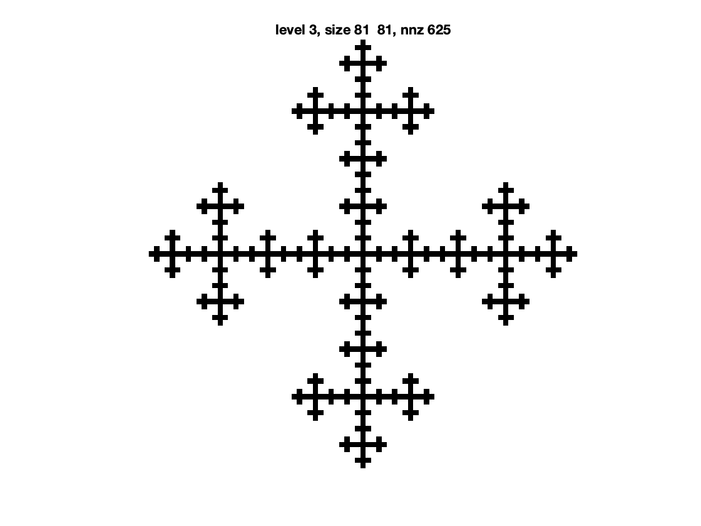

# KRON_SELF - Produce a self-similar image using the Kronecker matrix product

Source Evernote title: `# KRON_SELF - Produce a self-similar image using the Kronecker matrix product`  
Created: 2024-02-15  
Updated: 2024-02-15

## Attachments

- [kron_self_example.png](attachments/kron_self_example.png) (image/png, 0.0 MB)
- [kron_self.m](attachments/kron_self.m) (application/octet-stream, 0.0 MB)

## Note

%

% KRON_SELF

%

% Produce a self-similar image using the Kronecker matrix product.

%

[kron_self.m](attachments/kron_self.m)

